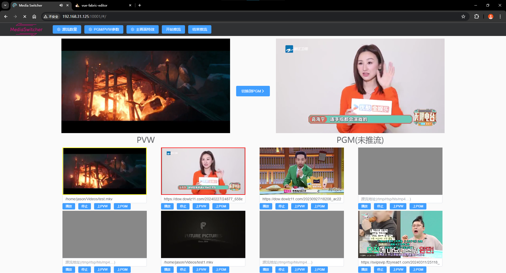
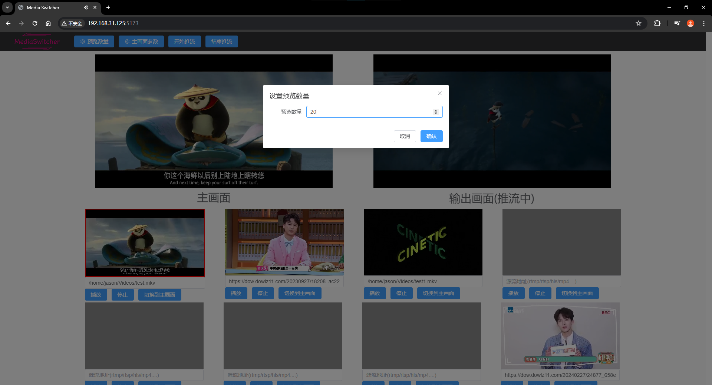
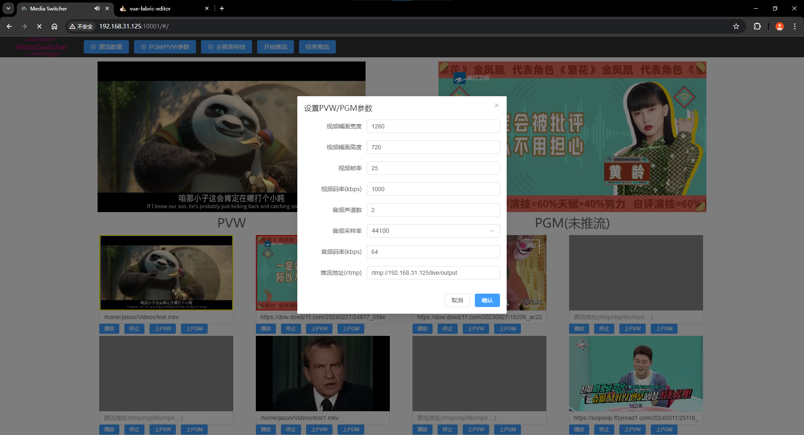
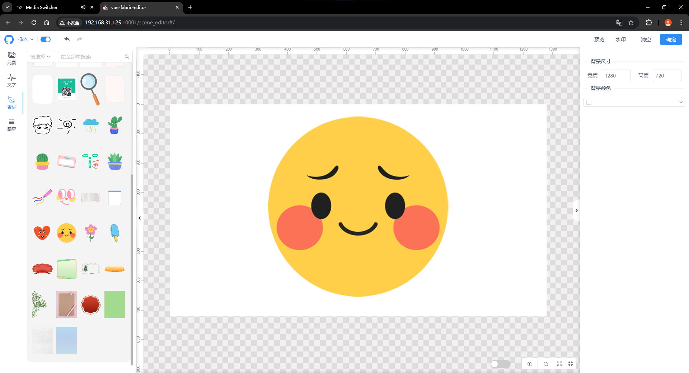
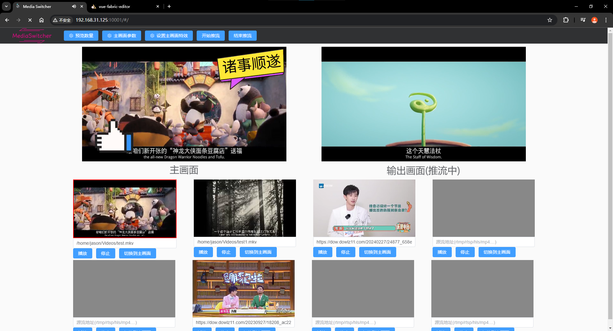
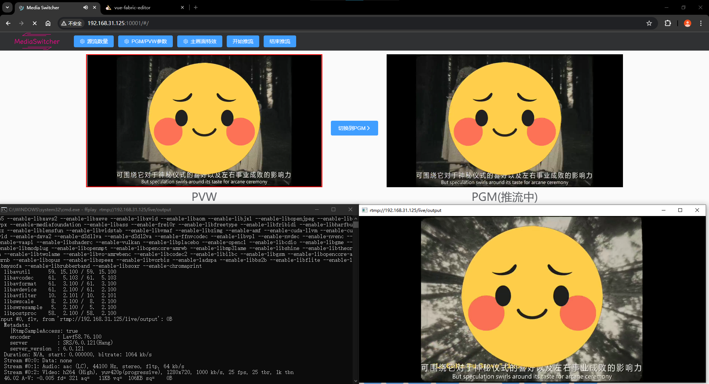

## 直播画面切换平台

小预览可以设置多个（数量不限，只要你的机器抗得住）常见的源流（rtmp/rtsp/hls/mp4/mkv....）（h264/h265/aac/ac3），选择其中一个推流出去（目前只支持 rtmp 推流）<br>

小预览编码的幅面固定是 320x180，帧率 15<br>

PVW 和 PGM 可以自己设置幅面，帧率，码率，推流地址 <br>

PVW 选中时对应的视频框为黄色，PGM 选中时对应的视频框为红色<br>

PVW 可以设置特效（叠加水印，文字，图片等等）<br>

PGM 可以选中任何一个小预览，或者是 PVW。典型的应用场景就是，设置一个预览垫片，上到 PGM，然后在 PVW 设置好预览流和特效之后，把 PVW 上到 PGM<br>

由于系统是对所有源流进行解码，做图像处理和视频幅面/帧率变换和音频重采样，最后编码成 h264 和 aac 推流出去，所以对硬件资源要求比较高

## 依赖项目

特效编辑器依赖<br>
https://github.com/nihaojob/vue-fabric-editor<br>
感谢大佬的项目

## 系统要求

ubuntu 20.04 以上

## 启动方式

克隆仓库

```
git clone https://github.com/BromideY/media-switcher-demo.git
git lfs fetch
```

第一次启动需要准备运行环境

```
bash ./PrepareEnv.sh
```

接下来就可以运行程序了

1. `bash ./Start.sh`
2. 打开 http://localhost:10001 （可以在 Start.sh 里面配置端口）

## 截图













